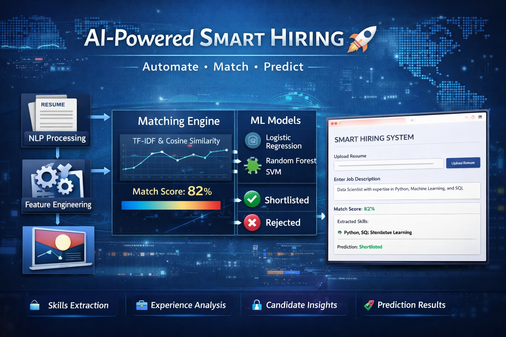

# 🚀 AI-Powered Smart Hiring & Candidate Intelligence Platform

---

## 📌 Overview

This project is an end-to-end **AI/ML-powered recruitment system** designed to automate and enhance the hiring process.

It intelligently processes resumes, matches candidates with job descriptions, and predicts candidate suitability using machine learning techniques.

💡 The goal is to help recruiters:

* Save time ⏱️
* Improve hiring accuracy 🎯
* Gain deeper insights into candidate profiles 📊

---

## 🎯 Objectives

* Automate resume screening
* Match candidates with job descriptions
* Extract key information (skills, experience)
* Predict candidate selection (Shortlist / Reject)
* Provide a user-friendly interface for recruiters

---

## 🏗️ Project Architecture

```
Resume → NLP Processing → Feature Engineering →
Matching Engine → ML Model → Output → Streamlit UI
```

---

## 📂 Dataset

* Resume Dataset (CSV format)

### Columns:

* `Resume_str` → Raw resume text
* `Category` → Job role/category

---

## ⚙️ Features

### 🔹 1. Data Preprocessing

* Removed missing values and duplicates
* Cleaned and normalized text
* Standardized resume content

---

### 🔹 2. NLP Processing

* Tokenization
* Stopword removal
* Lemmatization
* Cleaned text generation

---

### 🔹 3. Feature Engineering

* Skills extraction (dictionary + regex)
* Experience extraction (date parsing)
* Skills count
* Encoded job categories
* Scaled numerical features

---

### 🔹 4. Matching Engine

* TF-IDF vectorization
* Cosine similarity

📌 **Match Score Formula:**

```
Similarity = (A · B) / (||A|| × ||B||)
```

* Final score scaled between **0–100**

---

### 🔹 5. Machine Learning Model

Models used:

* Logistic Regression
* Random Forest
* Support Vector Machine (SVM)

📌 **Prediction Output:**

* Shortlisted ✅
* Rejected ❌

---

### 🔹 6. Advanced Enhancements

* BERT-based skill extraction (optional)
* Improved matching using n-grams
* Combined feature scoring

---

### 🔹 7. Streamlit Web App

Features:

* Upload resume 📄
* Enter job description 📝
* Display results:

  * Match score
  * Extracted skills
  * Prediction result

---

## 🧠 Technologies Used

* Python
* Pandas, NumPy
* Scikit-learn
* NLTK
* Transformers (BERT)
* Streamlit

---

## 📊 Workflow

1. Load and clean dataset
2. Apply NLP preprocessing
3. Extract features (skills, experience)
4. Compute match score
5. Train ML model
6. Predict candidate outcome
7. Display results in UI

---

## 📈 Example Output

* **Match Score:** 78.5%
* **Skills:** Python, SQL, Excel
* **Prediction:** Shortlisted

---

## 📦 Release Versions

🔗 **All Releases:**
https://github.com/indiranivas/levelshift_miniproject/releases

---

### 🔹 v0.1.1 — Initial Prototype

📌 **Release Link:**
https://github.com/indiranivas/levelshift_miniproject/releases/tag/v0.1.1

**Description:**
The first working version with basic functionality.

**Features:**

* Resume upload and parsing
* Basic NLP preprocessing
* TF-IDF similarity matching
* Match score calculation
* Simple Streamlit UI

**Limitations:**

* No ML prediction
* Basic feature extraction
* Limited accuracy

---

### 🔹 v1.0.0 — Production-Ready System 🚀

📌 **Release Link:**
https://github.com/indiranivas/levelshift_miniproject/releases/tag/v1.0.0

**Description:**
A complete and enhanced system with advanced ML capabilities.

**Features:**

* Advanced NLP preprocessing
* Skill and experience extraction
* TF-IDF + cosine similarity matching
* Machine learning prediction models
* Improved scoring system
* Enhanced UI
* Optional BERT integration

**Key Improvements:**

* ✔ ML-based prediction
* ✔ Better feature engineering
* ✔ Higher accuracy
* ✔ Scalable design

---

## 📌 Versioning Strategy

This project follows **Semantic Versioning (SemVer):**

```
MAJOR.MINOR.PATCH
```

* **MAJOR** → Breaking changes
* **MINOR** → New features
* **PATCH** → Bug fixes

Examples:

* `v0.0.1` → Initial prototype
* `v1.0.0` → Stable release

---

## 🚀 How to Run

### 1. Clone the repository

```bash
git clone https://github.com/indiranivas/levelshift_miniproject.git
cd levelshift_miniproject
```

---

### 2. Install dependencies

```bash
pip install pandas numpy scikit-learn nltk streamlit transformers
```

---

### 3. Run the application

```bash
streamlit run app.py
```

---

## 🔖 Access Specific Versions

```bash
git checkout v0.0.1
git checkout v1.0.0
```

---

## 📌 Future Improvements

* RAG-based recruiter chatbot 🤖
* Fine-tuned skill extraction models
* Real-time hiring system integration
* Cloud deployment (AWS / GCP / Azure)
* Resume ranking dashboard

---

## 👨‍💻 Author

Developed as part of an AI/ML project for Smart Hiring System.

🔗 GitHub Repository:
https://github.com/indiranivas/levelshift_miniproject

---

## ⭐ Conclusion

This project demonstrates how **AI and Machine Learning can transform traditional hiring processes** into intelligent, automated, and scalable systems.

It combines NLP, ML, and real-world application design to create a powerful recruitment assistant.

---

### ⭐ If you like this project, don’t forget to star the repository!
